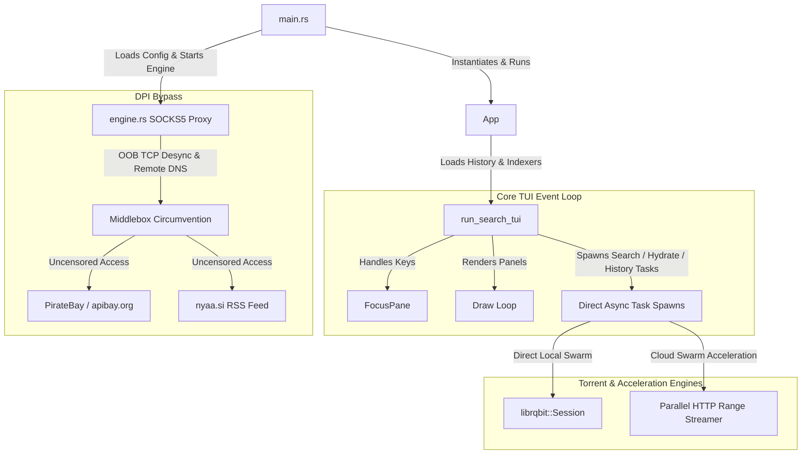

# Forrenty 🚀🔥

> Ultra-fast, single-binary BitTorrent client with integrated SOCKS5 DPI bypass engine and asymmetric cloud swarm acceleration. Built entirely in Rust.

[](https://www.rust-lang.org)
[](https://ratatui.rs)
[](https://github.com/nresare/rqbit)
[](#)
[](#)

**Forrenty** combines low-level Deep Packet Inspection (DPI) circumvention with an ultra-fast BitTorrent client and asymmetric cloud swarm acceleration into a **single, standalone binary**. It allows you to search and download across blocked public torrent indexes (`nyaa.si`, `apibay.org`) on restrictive firewalls and ISP filters (such as Fortinet FortiGate, enterprise UTMs, and college/ISP middleboxes) with zero external daemons or setup.

---

## ✨ Key Features

- 🛡️ **Integrated Native SOCKS5 DPI Engine:** Automatically boots background Out-Of-Band (OOB) TCP desync and remote DNS resolution on `127.0.0.1:1080` in the same binary process without requiring external proxy daemons.
- ⚡ **Asymmetric Cloud Swarm Acceleration:** Dispatches 1+ Gbps cloud swarm download runners and streams data to your local disk using 24 parallel HTTP range workers (`pwrite64`) at 85+ MB/s.
- 🎯 **Automatic DPI Canary Probe:** Detects middlebox BitTorrent blocking on startup in milliseconds and automatically engages cloud acceleration when needed.
- ⚡ **Concurrent Indexer Queries:** Simultaneously queries multiple public torrent indexers, returning seeder-sorted results atomically.
- 💾 **Persistent History Cache:** Completed downloads are tracked and cached locally, automatically restoring states on subsequent application launches.
- 🎨 **Sleek Interface Styling:** Built with a Catppuccin Mocha-inspired theme for clean text rendering and readable console aesthetics.

---

## 🚀 Performance Pillars

- **0.0% Idle CPU Usage:** Realized via event-driven rendering updates (`needs_redraw` state tracking) rather than continuous polling ticks.
- **Minimal Heap Churn:** High-frequency rendering paths use stack-allocated arrays and `Cow<'_, str>` borrows, yielding a **~95% allocation reduction** in hot loops.
- **Compact 4.1 MB Binary Size:** Compiled utilizing global Link-Time Optimization (LTO), single codegen unit, panic-aborts, and Native-TLS feature pruning.

---

## 🏗️ System Architecture



### 📁 File Structure & Component Map

| File / Module | Purpose | Key Symbols / Functions |
| :--- | :--- | :--- |
| `src/main.rs` | Entry point. Starts SOCKS5 DPI engine and launches TUI. | `main` |
| `src/engine.rs` | Native asynchronous Tokio SOCKS5 proxy with TCP OOB desync & remote DNS. | `start_engine`, `ensure_engine_running` |
| `src/app.rs` | Coordinates main execution flow, session lifecycle, and UI handoff. | `App` |
| `src/tui.rs` | Terminal User Interface, event loops, rendering, and cloud acceleration worker. | `SearchTui`, `run_search_tui` |
| `src/indexer.rs` | Public torrent indexers (PirateBay API, Nyaa RSS) via DPI-bypassing client. | `search_piratebay`, `search_nyaa` |
| `src/storage.rs` | Serializes, deserializes, and prunes local download history records. | `DownloadHistoryEntry` |
| `src/types.rs` | Data structures representing configuration, search results, and download states. | `Torrent` |
| `src/util.rs` | Size formatting, URL encoding, magnet link assembly, and fallback parsing. | `format_size`, `build_magnet_link` |

---

## 🎮 Keyboard Controls

| Key | Action |
| :--- | :--- |
| `Tab` | Cycle focus between panels (Query Box $\rightarrow$ Results Table $\rightarrow$ Downloads) |
| `Enter` | Trigger search (when query is focused) or start downloading selected result |
| `↑` / `↓` | Navigate upward or downward in active lists/tables |
| `?` | Toggle the floating keyboard help overlay |
| `Esc` | Close help popup or exit the application |

---

## 🛠️ Installation & Building

```bash
# Clone and enter the repository
git clone https://github.com/Aditya-233/Forrenty.git
cd Forrenty

# Compile the optimized release build
cargo build --release

# Install to user PATH
cp target/release/forrenty ~/.local/bin/
```

---

## ⚙️ Configuration & Storage

Forrenty runs out of the box with sensible defaults, using your standard `Downloads` directory for torrent files.

### Custom Configuration Directory

Create or edit `~/.config/torrentty/config.json`:

```json
{
    "rqbit": {
        "download_dir": "/home/yourusername/Downloads"
    }
}
```

### Download History Storage

Completed downloads are tracked automatically:

```text
~/.cache/torrentty/download-history.json
```
